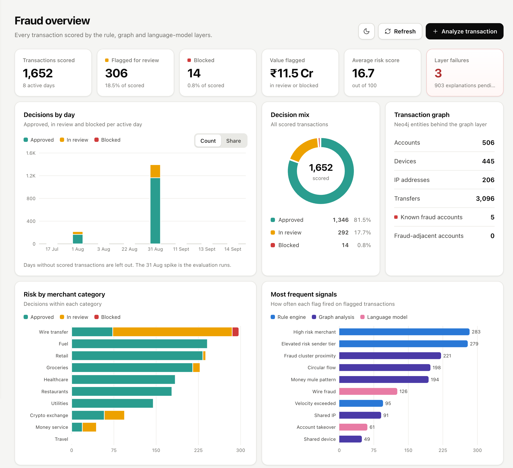

<div align="center">

# Indus11 — AI Financial Risk & Fraud Decision Engine

**Real-time transaction fraud detection that scores every payment 0–100, returns APPROVE / REVIEW / BLOCK, and explains the decision in plain English.**

[](https://github.com/OWNER/indus11/actions/workflows/ci.yml)


</div>



---

## Why it exists

Banks must approve or block a payment in milliseconds. Rule-only systems miss coordinated fraud; pure ML systems can't explain *why* they blocked a customer. **Indus11** combines three independent engines into one explainable score:

| Engine | Catches | Tech |
|--------|---------|------|
| **Rule engine** | velocity bursts, amount anomalies, blacklists, risky merchants | Python, Redis sorted-sets |
| **Graph analyzer** | fraud rings — shared devices/IPs, circular money-mule flows | Neo4j + Cypher |
| **RAG + LLM** | context-aware risk + a written reason for every decision | LangChain, ChromaDB, local LLM (Ollama) |

Scores combine into a **0–100 composite** → `APPROVE (0–39)` · `REVIEW (40–69)` · `BLOCK (70+)`. The LLM is capped at 30/100 so reliable rule and graph evidence stays in control.

## Features

- ⚡ **Real-time REST API** — all three engines run concurrently via `asyncio.gather()`
- 🕸️ **Fraud-ring detection** — Neo4j graph traversal for shared-device and circular-flow patterns
- 🧠 **Explainable AI** — RAG retrieves similar fraud patterns; the LLM writes the reason
- 📊 **Live React dashboard** — risk metrics, decision mix, score distribution, flagged-transaction feed
- 👁️ **Analyst workflow** — click any flagged transaction for full detail; approve or block a review inline; attach an optional reason to any transaction
- 🐳 **One-command deploy** — full stack (API + dashboard + 3 databases) via `docker compose up`
- ✅ **Tested** — pytest suite + GitHub Actions CI

## Architecture

```
        React dashboard ──▶ FastAPI gateway ──▶ Redis (cache) / MongoDB (profiles)
                                   │
             ┌─────────────────────┼─────────────────────┐   (run concurrently)
             ▼                     ▼                     ▼
        Rule engine        Graph analyzer          RAG pipeline
        (0–40)             Neo4j (0–30)            ChromaDB + LLM (0–30)
             └─────────────────────┼─────────────────────┘
                                   ▼
                         Decision engine → 0–100 → APPROVE / REVIEW / BLOCK
                                   ▼
                          MongoDB (persist + audit)
```

## Quick start (Docker — recommended)

```bash
git clone https://github.com/OWNER/indus11.git
cd indus11
docker compose up --build
```

- Dashboard → http://localhost:5173
- API docs (Swagger) → http://localhost:8000/docs

The API container seeds MongoDB (20 accounts) and Neo4j (500 accounts, ~1,000 transactions with planted fraud rings) on start.

> **LLM layer (optional):** set `OPENAI_API_KEY` in your environment, or run [Ollama](https://ollama.com) locally (`ollama pull llama3`) and set `LLM_PROVIDER=ollama`. Without either, the rule and graph engines still decide; only the AI reason is skipped.

## Static demo (Vercel)

The full stack cannot run on a static host — it needs four databases and a local
language model, and one analysis takes ~14 s. So the deployed build runs in **demo
mode**: it reads `dashboard/public/demo-data.json`, a committed snapshot of a real
local run, and disables the actions that would write.

```bash
cd dashboard && VITE_DEMO=1 npm run build   # dist/ is a self-contained static site
```

To deploy: import the repo on Vercel and set **Root Directory** to `dashboard`.
`dashboard/vercel.json` supplies the framework, build command and `VITE_DEMO=1`.
The demo is labelled as such in the UI — the numbers are real, the interactivity is not.

Refresh the snapshot any time from a running stack:

```bash
python -m scripts.snapshot_demo
```

## Run locally (without Docker)

```bash
python3.12 -m venv .venv && source .venv/bin/activate
pip install -r requirements.txt
cp .env.example .env                    # fill in keys if using OpenAI
./scripts/run_local.sh                  # starts DBs, seeds, runs API on :8000
cd dashboard && npm install && npm run dev   # dashboard on :5173
```

## API

| Method | Endpoint | Description |
|--------|----------|-------------|
| `POST` | `/api/v1/transactions/analyze` | Score a transaction |
| `GET`  | `/api/v1/transactions/{tx_id}` | Retrieve a past analysis |
| `PATCH`| `/api/v1/transactions/{tx_id}/decision` | Override a review (approve/block) |
| `GET`  | `/api/v1/graph/account/{id}/neighbors` | Explore an account's graph |
| `GET`  | `/api/v1/stats/risk-distribution` | Dashboard metrics |
| `GET`  | `/api/v1/stats/recent-flags` | Recent REVIEW/BLOCK transactions |
| `GET`  | `/api/v1/stats/accuracy` | Latest evaluation: precision, recall, confusion matrix |

```bash
curl -X POST http://localhost:8000/api/v1/transactions/analyze -H "Content-Type: application/json" -d '{
  "tx_id": "TX-001", "sender_account_id": "ACC-013", "receiver_account_id": "ACC-451",
  "amount": 704000, "currency": "INR", "merchant_category": "wire_transfer",
  "device_id": "DEV-FRAUD-A", "ip_address": "203.0.113.66"
}'
```

## Tests

```bash
pytest -q
```

## Accuracy

With the stack running, replay a labelled synthetic dataset through the full pipeline:

```bash
python -m scripts.evaluate
```

It prints precision / recall / F1 and a confusion matrix, reports how many planted
mule-ring hops the graph layer caught, and sweeps the decision bands to suggest the
`REVIEW_THRESHOLD` / `BLOCK_THRESHOLD` pair with the best F1. Results are written to
`docs/eval-results.json` and shown in the dashboard's accuracy panel.

Latest run — 208 transactions (52 fraud / 156 legitimate), thresholds 40 / 70:

| Metric | Value |
|--------|-------|
| Precision (flagged) | **93.8%** |
| Recall (flagged) | **86.5%** |
| F1 | **90.0%** |
| Mule-ring hops caught by the graph layer | **36 / 36** |

|  | Actually fraud | Actually legitimate |
|--|---------------|---------------------|
| **APPROVE** | 7 | 153 |
| **REVIEW** | 45 | 3 |
| **BLOCK** | 0 | 0 |

**The block band never fires.** Every detected fraud lands in REVIEW — no transaction
reached 70, so nothing is auto-blocked and all 45 catches need an analyst. The sweep
suggests review ≥ 35 / block ≥ 40 for the same F1, which would auto-block most fraud
at the cost of auto-blocking the 3 false positives too. Choosing that trade-off is the
next piece of work, not a setting to change blindly.

> Ground truth is the fraud planted by `scripts/seed_neo4j.py` (mule rings, shared-device
> and shared-IP identity clusters). Fraud is far denser in this set than in a real payment
> feed, so the precision figure is optimistic — it measures the engines' separation, not
> production performance.

## Tech stack

Python 3.12 · FastAPI · MongoDB (Beanie) · Neo4j · Redis · ChromaDB · LangChain · Ollama/OpenAI · React + Vite + Recharts · Docker Compose · pytest

## Roadmap

- [x] 5-layer analysis pipeline, live dashboard, Dockerised deploy
- [x] Analyst review workflow (detail view, approve/block override, reason notes)
- [x] Accuracy evaluation on the synthetic dataset (precision / recall / confusion matrix)
- [ ] Trained ML classifier as a fourth scoring signal
- [ ] Fraud-ring visualisation in the dashboard
- [ ] API authentication + hardening

## Team

Joshi Om · Krish Gajera · Drashti Dedaniya — CHARUSAT / DEPSTAR

## License

MIT — see [LICENSE](LICENSE).
